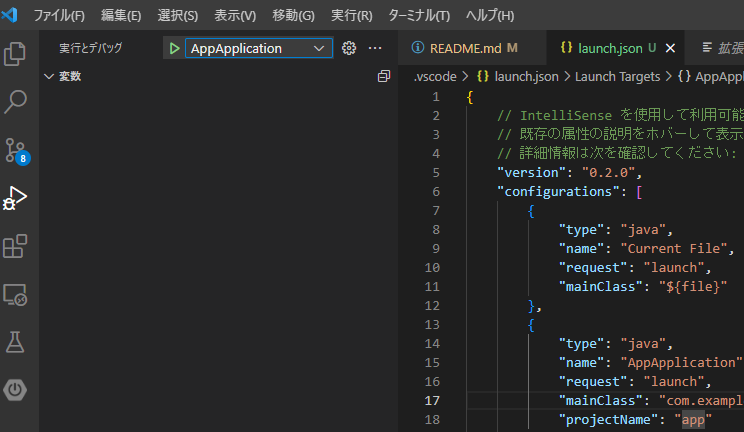
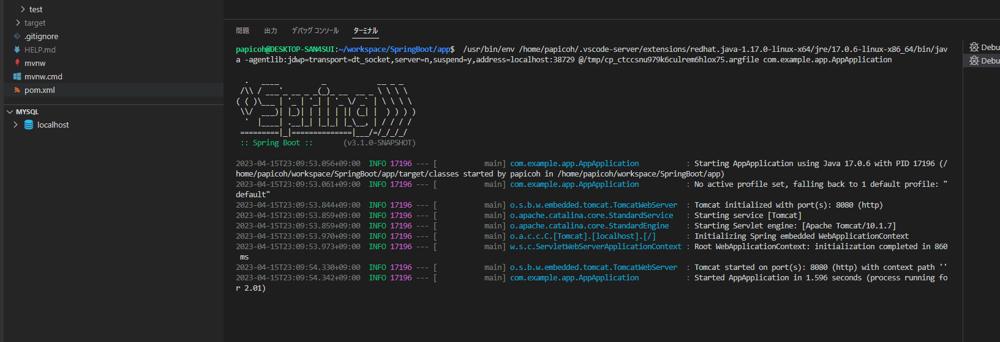
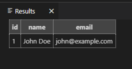

# SpringBoot
Java練習用（Spring boot）

## 環境構築
### 前提
- Ubuntu20.04(wsl2)  


### GitHubからUbuntu上へクローン
- VSCodeで好きなディレクトリにクローン（完）

- VSCode拡張機能一覧
  - Spring Boot Extension Pack
  - Extension Pack for Java

### 動作確認
- サーバ起動（AppApplicationの左の▷をクリック）  


- ターミナル確認


- ブラウザアクセス  
[http://localhost:8080/hello](http://localhost:8080/hello)  


### DB作成（mysql）
- ubuntu上で以下コマンドを実行
  - pidをsystemctlにする
    ``` 
    sudo touch /etc/wsl.conf
    sudo vim /etc/wsl.conf
    ```
      - wsl.conf記述内容
        ``` 
        [boot] 
        systemd=true
        ```
  - ubuntuを再起動  
    ``` wsl --shutdown ```

  - mysqlインストールコマンド
    ```
    sudo apt-get update
    sudo apt-get install mysql-server
    sudo mysql_secure_installation
    ```

    ```
    sudo systemctl start mysql
    mysql -u root -p
    ```
  
  - /app/db/ddl/create.sql　を実行（方法は任せる）
  
  
  - mysql終了コマンド  
  ``` sudo systemctl stop mysql ```


