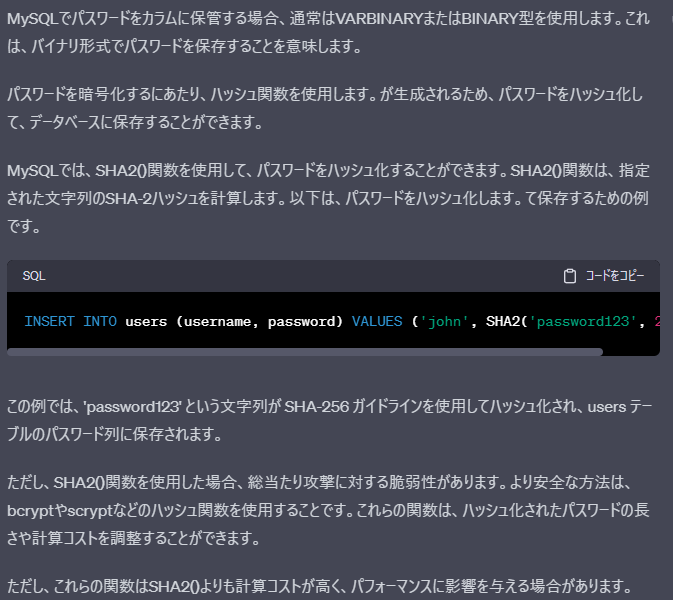

# テーブル設計書

## Schema
- school_managedDB

## TableName
- 論理名：ユーザ  
- 物理名：USER  

## ColumnList
| 物理名 | 論理名  | データ型   | Primary Key | NOT NULL | デフォルト | コメント | 備考 | 
| ------ | ------ | --------  | ----------- | -------- | ---------- | -------- | -------- | 
| id     | ID     | INT(6)     | Primary Key | NOT NULL |  | ユーザID | 社員番号いれる？  |  
| name   | 氏名   | VARCHAR(20) |  | NOT NULL | 'DEFAULT NAME' | ユーザ氏名 |   |   
| password | パスワード | VARCHAR or BINARY |  | NOT NULL | '' | ログインパスワード | SHA2関数で暗号化する。実装時に楽であればなんでも。  |   
| email | メールアドレス | VARCHAR(256) |  | NOTNULL | 'DEFAULT EMAIL' | メールアドレス |   |  
| address | 住所 | VARCHAR(256) |  | NOTNULL | 'DEFAULT ADDRESS' | 住所 |   |  
| phone | 電話番号 | VARCHAR(21) |  | NOTNULL | '未登録' | 電話番号 |   |  
| delete_flag | 削除フラグ | boolean |  | NOTNULL | false | 削除フラグ |   |  
| insert_date | 登録日時 | datetime |  | NOTNULL | CURRENT(insert) | 登録日時 | エンティティリスナにて自動設定 |  
| update_date | 更新日時 | datetime |  | NOTNULL | CURRENT(update) | 更新日時 | エンティティリスナにて自動設定  |  
| delete_date | 削除日時 | datetime |  | NOTNULL | CURRENT(delete) | 削除日時 |  削除時に設定 |  

## Other  
### MySQLのPW保管について
- 【結論】実装コストが低けりゃなんでもいいや  

